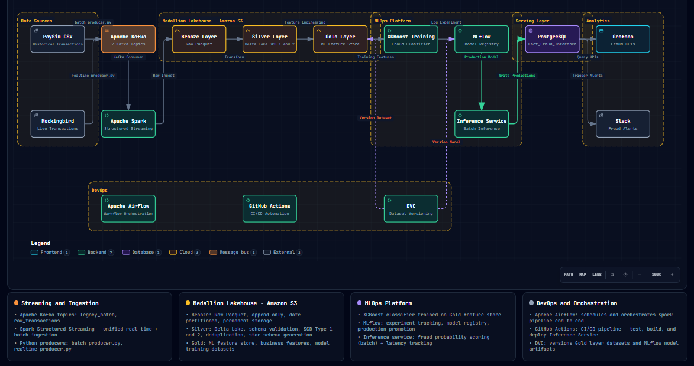

# Real-Time Fraud Detection Data Engineering Pipeline

[](https://github.com/Noumanaref/fraud-detection-pipeline/actions)
[](https://www.python.org/)
[](https://spark.apache.org/)
[](https://delta.io/)
[](https://mlflow.org/)

An end-to-end data engineering and MLOps system that processes **3.5 million+ financial transaction records**, trains machine learning models to detect fraud, and serves live predictions for business monitoring and alerting.

---

##  System Architecture

The project follows a modern **Medallion Lakehouse** architecture combined with a **Kappa streaming design**, ensuring raw data is safely stored while fast analytics run smoothly.




##  Tech Stack

* **Data Ingestion & Streaming:** Apache Kafka, Python Producers
* **Distributed Processing & Storage:** Apache Spark (PySpark), Delta Lake, AWS S3
* **Model Training & Tracking:** XGBoost, MLflow Model Registry
* **Dataset & Model Versioning:** DVC (Data Version Control)
* **Workflow Orchestration:** Apache Airflow
* **Serving & Visualization:** PostgreSQL, Grafana, Slack Webhook Alerts
* **CI/CD & Quality Assurance:** GitHub Actions, Flake8, Black

---

##  Key Performance Optimizations

* **Memory Management:** Expanded driver memory to 6GB and used all local CPU cores (`local[*]`) to process 3.5M+ rows without crashing.
* **Smart Caching:** Cached Spark DataFrames in memory to avoid scanning AWS S3 storage multiple times during star-schema table creation.
* **Partition Tuning:** Reduced default Spark shuffle partitions from 200 down to 8 to match hardware limits and prevent small-file clutter on S3.
* **Pandas Protection:** Selected only required columns before converting Spark data to Pandas, stopping driver Out-Of-Memory (OOM) errors.

---

##  Getting Started

### Prerequisites
* Docker and Docker Compose installed
* Python 3.8 or higher installed
* AWS Account with an S3 bucket configured

### Installation Guide

1. **Clone the repository:**
   ```bash
   git clone [https://github.com/](https://github.com/)[YOUR_GITHUB_USERNAME]/fraud-detection-pipeline.git
   cd fraud-detection-pipeline


2. **Set up environment variables:**
   ```bash
   AWS_ACCESS_KEY_ID=[YOUR_AWS_ACCESS_KEY]
   AWS_SECRET_ACCESS_KEY=[YOUR_AWS_SECRET_KEY]
   MLFLOW_TRACKING_URI=http://localhost:5000

 
3. **Run the infrastructure using Docker Compose:**
     ```bash 
    docker-compose up -d


4. **Execute the data processing and training pipeline:**
   ```bash
    dvc repro


5. **Monitoring and Alerts:**
   The system connects processed predictions to PostgreSQL, feeding live dashboards in Grafana. If unusual transaction spikes occur, automated webhooks trigger instant alerts straight to Slack.


Read the full [Comprehensive Technical Documentation](docs/technical_documentation.md) for a deep dive into the architecture and optimizations.
